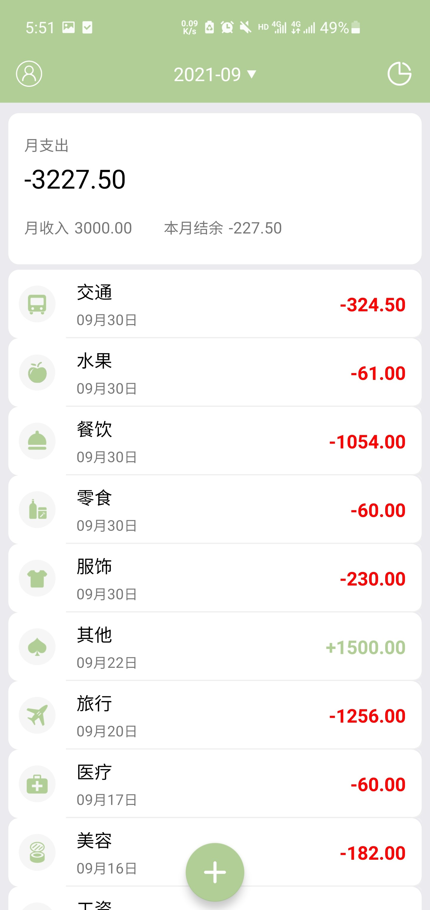

# Mung_Account
### 描述

* 项目起因：2021年9月，安卓实训项目
* 项目内容：基于安卓与Django的记账软件
* 项目使用方法：对于安卓源码可以直接导入，Django需要修改Setting.py文件中的数据库配置

### 功能实现

1. 用户登录模块
   1.   注册登录信息:系统包括用户登录验证、注册账号、忘记密码
   2.  信息修改：用户可以对用户的个人信息进行信息修改

2. 账单列表显示模块
   1.  账单筛选：按照月份筛选账单
   2. 查看账单：罗列该月每笔账单的日期、类型、金额
   3. 编辑账单：对选中账单可执行删除以及编辑操作

3. 记账模块
   1. 选择记账分类：选择记录支出账单或者收入账单
   2. 记录账单信息：记录账单类型、账单金额、账单日期，账单备注

4. 账单统计模块
   1. 账单统计：统计月收支总图以及结余、计算日均支出
   2. 图表分析：折线图——显示日收支金额；饼状图——显示月收支类别比例

### 程序效果

